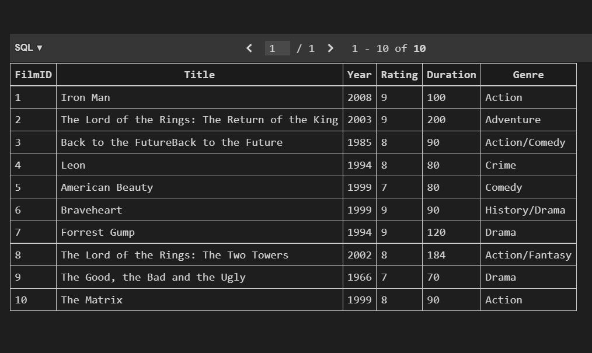

# FilmFlix-Python-App-with-database
FilmFlix application

<h2>Introduction</h2> 

You have been asked to develop a command line python application for FilmFlix, to manage their film database. As a start-up FilmFlix have no more than 40 records of films in their database. A database developer volunteered to work with FilmFlix a while back to develop their database and for ease of use and integration implemented SQLite3 SQL database. However, due to unforeseen circumstance the developer is unable to connect the database with python application, but a copy of the SQLite database has been made available for you to work with if you chose to. Otherwise, you can create the database using SQLite. 

<h3>Note:</h3>

CRUD: Create Read Update Delete.
Only one table in the database with records, which is all you need for this project.
Database name filmflix.db 
Table name tblfilms
filmID(integer), title(text), yearReleased(integer),rating(text),duration(integer),genre(text)

You have now been tasked with developing a python application to manipulate the FilmFlix database.
  Perform CRUD operation on the database from the python command line

<ul>
  <li>Print all records in  tblfilms in database filmflix.db</li>
  <li>Allows users to add, update or delete records in the filmflix.db database (CRUD)</li>
  <li>Print a selection of reports, these functions demonstrate different techniques of writing sql commands and printing reports</li>
</ul>
	

Hint: for FilmFlix CRUD: create Options menu to include 
Options menu

<ol>
  <li>Add a record</li>
  <li>Delete a record</li>
  <li>Amend a record</li>
  <li>Print all records</li>
  <li>Exit</li>
</ol>

Hint: for FilmFlix report create Options menu to include 

<ol>
  <li>Print details of all films</li>
  <li>Print all films of a particular genre</li>
  <li>Print all films of a particular year</li>
  <li>Print all films of a particular rating</li>
  <li>Exit</li>
</ol>

